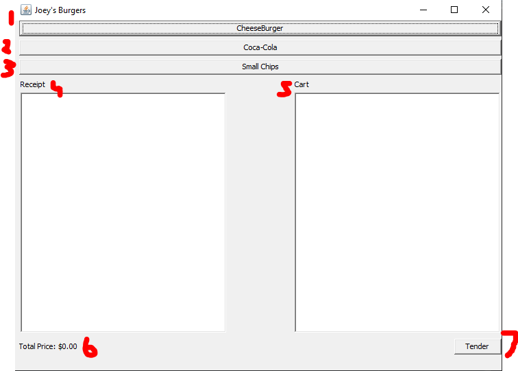
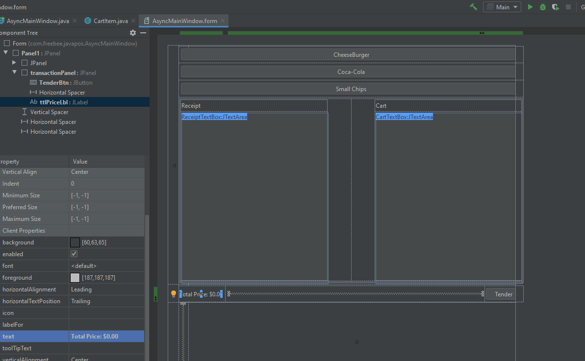
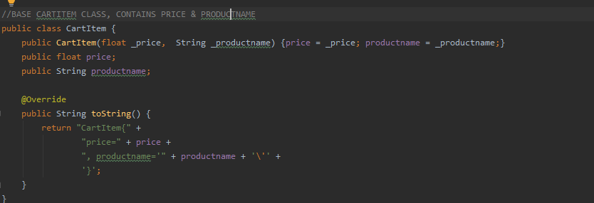
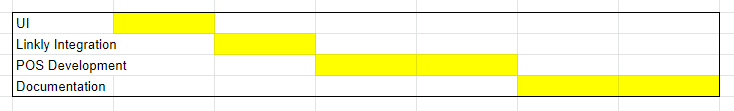

# Open Source Java POS

## Summary



A very simple POS with basic functionality written in Java, whilst also using the TCPIP interface for JAVA from linkly. (https://github.com/pceftpos/EFTClient.IPInterface.Java) Currently there are 7 parts of this POS:

- 1-3: Options for items to add to the cart
- 4 : Receipt box that will display the receipt + the transaction response class
- 5: The cart, every time the tender button or an item button is clicked, this textbox is updated with the current cart
- 6: Displays the current total price of the cart
- 7: Starts the transaction

## Time Taken/Design Considerations



As UI was not considered to be the major focus on this project, it was left small and simple, as the outcome I wanted was to be able to display all the data I needed to, not make it look pretty.

The UI is effectively cut up into three panels, which each panel have their own related functions:

- Panel 1: Items to add to cart, made up of 3 buttons
- Panel 2: Data display, made of two textboxes with scrollpanels. Cart & Receipts are displayed here.
- Panel 3: Transaction panel, includes a display for the total price of the transaction and a button to start the transaction.



The first non-UI part of this program I worked on was the CartItem class. Albeit a small and simple class, I wanted to implement this way for quality of life.

````java
CartItem chipsItem = new CartItem(5.35f, "Small Chips");
CartItem sodaItem = new CartItem(3.50f, "Coca-Cola 600mL");
CartItem burgerItem = new CartItem(10.75f, "Cheeseburger");

ArrayList<CartItem> currentCart = new ArrayList<CartItem>();
````

Having the cart as an Array of CartItems means that if Items require more values in them down the line (for example, quantity), It becomes a lot easier to add the change.

This little chart shows what I considered to be the most time consuming/important aspects of this project, in a non-unit measurement since there's no exact time here.



## Possible Improvements

There a larger number of improvements that can be made to this POS, even whilst still keeping it simple it nature. Here a couple examples:

### POS Improvements

- The cart display on screen could be updated to allow for the user to adjust the cart. For example being able to remove an item or to increase/decrease an item's quantity.
- The List of items should not be hardcoded, instead it should be pointing to either a file of items, and pulling the items from there. That way it can be easily adjusted if someone wants to replace a $10 Burger item, with a $5 salad item.
- The UI could be tidied up, especially with the item buttons. For example instead of being a long box with the name of the item, it could instead be a square panel that includes a picture of the item and the name underneath.

### Linkly Integration Improvements

- Currently only purchase transaction types can be performed through the POS. Through some UI changes, the POS could be improved to handle other transaction types such as refunding.
- Only the transaction request can be sent through at the moment. A settings window could be added to allow for options for other requests like Logon, to make sure the pinpad & client are still connected.
- Linkly's software allows for basket data to be sent up before the transaction is sent up. Since this program is effectively simulating the sale of a cart, it would make sense to upgrade this POS later to add the cart to the basket data request.

## Testing

Since this is a small project with no unfamiliar code, no unit tests are included with the project, however testing was still done to make sure that the project was actually working.

For example, the saving transactions to a file, which if I hadn't properly tested, would still look like

````
{
 "270220201003333 ": [
  {},  
  {},
 ],
 "Total Price": 49.95,
 "Total Items": 7
}
````

However, as much as I'd like to say everything here is absolute bug free, there is always the chance that I have completely missed something. If this is the case, please feel free to send an email to Callum@hands.net.au with details of the bug :)

## Release Notes:

### 1.0.0.0 4/12/2020 Callum Hands

- Initial Release